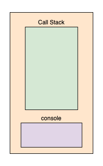
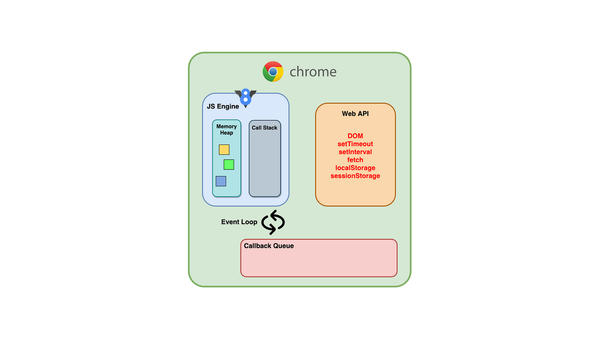
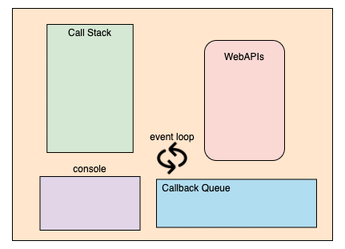

# TS-JS-Examples


# Javascript under the hood

# Introduction

Many Javascript developers have a great knowledge, on how to delivery applications, both on the frontend and backend, but several, never stoped to look how does Javascript works in the browser, how it’s interpreted, and what happens under the hood.

First of all, we need to say that Javascript is a single-threaded, interpreted language, that can run on browsers, or on your computer, using NodeJS, which is the famous Javascript runtime built on the top of Chrome’s V8 Javascript engine.

Now, that we presented Chrome’s V8, we can start with Javascript engines.

# Engines

So, the engine is a software  component that executes Javascript code, and as a interpreted language, like Python, the first engines were merely interpreters, but the most recent ones, have capabilities like JIT(Just-in-time compilation) for improved performance.

So, basically the engine is the guy that reads all the JS code, and converts it to machine code, so it can be executed.

As stated, Javascript is a single-thread application, which means it can only do a single thing at a time, the two main components of an engine are the heap memory (memory allocation) and the call stack (execution context).

# Heap Memory

It’s the part of the engine where the memory allocation for the variables and function declaration happens.  Some variables could be allocated on heap, like objects, while local and primitive data types are usually allocated on stack.

# Call Stack

It’s the part of the engine that is responsible for executing the code. When the code is parsed, from top to bottom, it gets pushed into the call stack. It works as a LIFO, meaning that the first one entering, will be executed and then popped off. The process will execute, until every block code is executed.

Any asynchronous code that enters on the stack, as it needs time to be completed, it will get popped off immediately, and sent to Web APIs provided by the runtime environment to get processed. We will talk later about the Web APIs.

If you take a look in the following code, the image illustrates how the process of executing it, happens on the call stack:

```jsx
power = (n, e) => {
  return Math.pow(number, e);
};

printPower = (n, e) => {
  const result = power(n, e);
  console.log(result);
};

printPower(5, 4); // 625
```


# The Runtime Environment

A Runtime environment for JavaScript can be the browser or the Node.js runtime environment which you have installed.

If the code is synchronous then it is executed right away. But, if some code requires a longer time to run, or needs to fetch some data, or needs some heavy processing, it will block the main thread. Blocking the main thread until everything gets completed will result in stopping the webpage from doing anything else. It will result in locking the page from scrolling, executing the further instructions, and rendering any new components is blocked until every task executes.

The JavaScript runtime environment (which includes the JavaScript engine) provides some components like the Web API, callback queue, and an event loop to make JavaScript concurrent. Let us discuss each of them in detail.



# **Web API**

Most of the asynchronous tasks that may need some time to get completed will get pushed onto the call stack, and they are then immediately popped off to the Web APIs part of the runtime environment.

A few of the Web APIs provided by the browser which have an asynchronous behaviour  are the DOM APIs, Timer (setTimeout and setInterval), Fetch API, and the synchronous ones are the Storage APIs (sessionStorage and localStorage).

You can take a look at all the available Web APIs [here](https://developer.mozilla.org/en-US/docs/Web/API).

# **Callback Queue (Task Queue)**

All the callbacks and results from the various Web APIs will get pushed onto the callback or task queue. All the callbacks/results will get queued and later be moved onto the call stack by the event loop.

The callback queue for the  Chrome browser has a Microtask queue and a Macrotask queue.

The callbacks, promises, asynchronous function calls are classified as microtasks. The above tasks have a priority over things like setTimeout, setInterval, DOM Events, etc., that are considered macro tasks.

The results and callbacks are moved onto their respective queues once they get processed by the WebAPIs.

# **Event Loop**

The event loop is a continuous process whose whole purpose is to look if the call stack is empty or not. If the call stack is empty, it will look at the callback queue for any queued callbacks or tasks and, it will push each of them to the call stack. Now, which one gets picked up first by the event loop is based on their priority.

The event loop first pushes the tasks from the microtask queue onto the call stack and later looks at the macrotask queue. This process repeats until everything in the callback or the task queue is pushed onto the stack and executes.

Now, let us take a look at a few examples with different Web APIs, along with what the event loop picks based on the micro and macro tasks from the callback queue.

An example showing the sequence of execution with a set timeout along with normal console logs:

```jsx
console.log("Start");

setTimeout(
  (callback = () => {
    console.log("callback here");
  }),
  2000
);

console.log("End");

// output:
// Start
// End
// callback here
```



An example showing the sequence of execution with a set timeout having zero time along with normal console logs:

```jsx
console.log("Start");

setTimeout(
  (callback = () => {
    console.log("callback here");
  }),
  0
);

console.log("End");

// output:
// Start
// End
// callback here
```


It’s important to mention that the web API, callback queue and the event loop, are all features from the runtime environment(browser/node), it’s not a V8 capability.

# How Does it Works with Promises ?

Promises were introduced on ES6 Javascript version, which almost all browsers and Node has support nowadays, and basically came to solve the callback hell problem, let’s take a look on the following asynchronous code:

```jsx
// Example asynchronous function
function asynchronousRequest(args, callback) {
  // Throw an error if no arguments are passed
  if (!args) {
    return callback(new Error('Whoa! Something went wrong.'))
  } else {
    return setTimeout(
      // Just adding in a random number so it seems like the contrived asynchronous function
      // returned different data
      () => callback(null, {body: args + ' ' + Math.floor(Math.random() * 10)}),
      500,
    )
  }
}

// Nested asynchronous requests
function callbackHell() {
  asynchronousRequest('First', function first(error, response) {
    if (error) {
      console.log(error)
      return
    }
    console.log(response.body)
    asynchronousRequest('Second', function second(error, response) {
      if (error) {
        console.log(error)
        return
      }
      console.log(response.body)
      asynchronousRequest(null, function third(error, response) {
        if (error) {
          console.log(error)
          return
        }
        console.log(response.body)
      })
    })
  })
}

// Execute 
callbackHell()
```

In this code, you must make every function account for a possible `response`and a possible `error`, making the function `callbackHell`visually confusing.

So, promises were created so make the things easier.

Now, looking into that following code, can you guess what it would be the order of the executed things?

```jsx
var p1 = new Promise(function(resolve, reject){
    resolve(1)
})
setTimeout(function(){
  console.log("will be executed at the top of the next Event Loop")
},0)
p1.then(function(value){
  console.log("p1 fulfilled")
})
setTimeout(function(){
  console.log("will be executed at the bottom of the next Event Loop")
},0)
```

If you run this code, you will see the following output:

```jsx
p1 fulfilled
will be executed at the top of the next Event Loop
will be executed at the bottom of the next Event Loop
```

Each event loop has a microtask queue and a macrotask queue.

A microtask is a task that is originally to be queued on the microtask queue rather than a task queue. Refer to https://www.w3.org/TR/html51/webappapis.html#microtask-queue.

There are two kinds of microtasks:

- solitary callback microtasks, such as `Promise`，
- and compound microtasks, such as `Object.observe`, `MutationObserver` and `process.nextTick` in Node.js.

And the macrotask queue mainly contains `setTimeout`, `setInterval`, `setImmediate`, `requestAnimationFrame`, `I/O` in Nodejs.

In a event Loop, these two task queues will run in two steps:

1. First, check whether there is a macrotask (call it X) in old macrotask queue ;
2. If X exists and it is running, wait for it to go to the next step until it was complete; otherwise, goto the next step immediately;
3. Second, run all microtasks of the microtask queue;
4. and when run the microtasks, we can still add some more microtaks into the queue, these tasks will also run.

In the last example:

1. First, your Promise initialize `new Promise` and `resolve` are synchronous;
2. and then synchronously add a `setTimeout` macroTask into the macrotask queue;
3. then synchronously add the microtask `promise.then(function(){})` to the microtask queue, this task will run immediately, because the Promise initialize and resolve are synchronous, this task run before any macrotask; so, console.log the `p1 fulfilled`;
4. then add the second macrotask `setTimeout` to macrotask queue;
5. after this event loop ended, run the two macrotasks;

https://javascript.plainenglish.io/how-does-javascript-actually-work-under-the-hood-567f9f17b855

http://latentflip.com/loupe/

https://www.youtube.com/watch?v=8aGhZQkoFbQ

https://www.digitalocean.com/community/tutorials/understanding-the-event-loop-callbacks-promises-and-async-await-in-javascript

https://medium.com/jspoint/how-javascript-works-in-browser-and-node-ab7d0d09ac2f